# ninja-trivia 
### Trivia app for game based learning
Ninja trivia is a app for creating and playing trivia games to help bring some fun to studying. This app is written with Java in Spring Tool Suite and is meant to be a full CRUD application for Coding Dojos Java project week. Update and delete features to be added soon.

### Login/Registration
##### Front page with login and registration forms
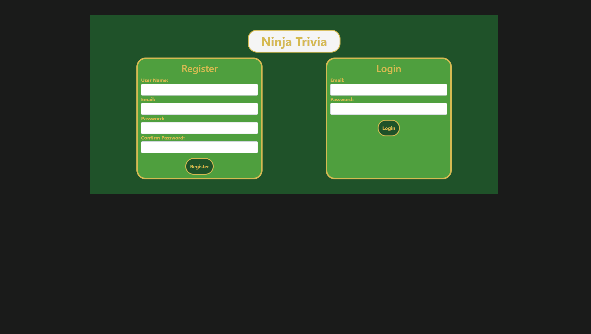

##### Login and registration validations to ensure forms are completed properly
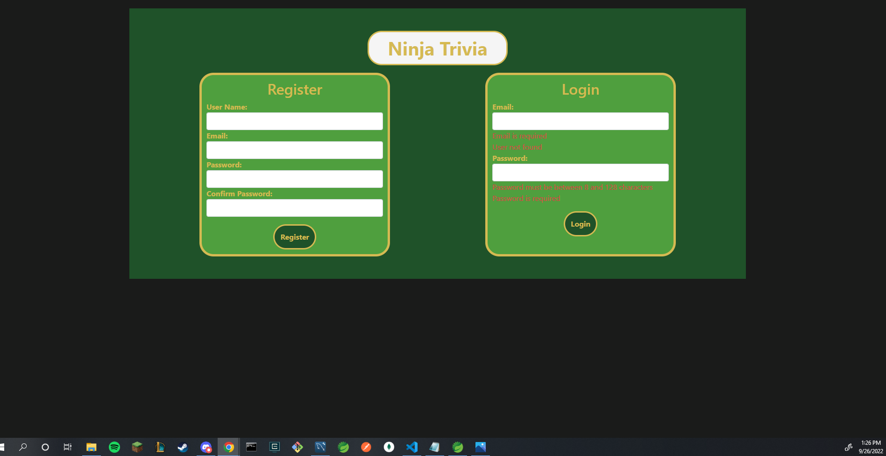
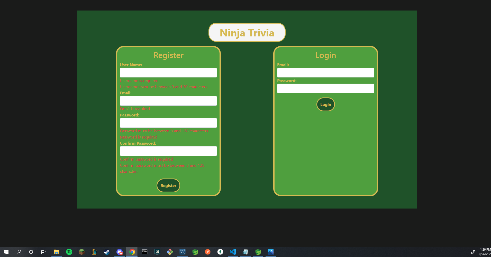

##### Upon successful login or registration users are brought to the dashboard
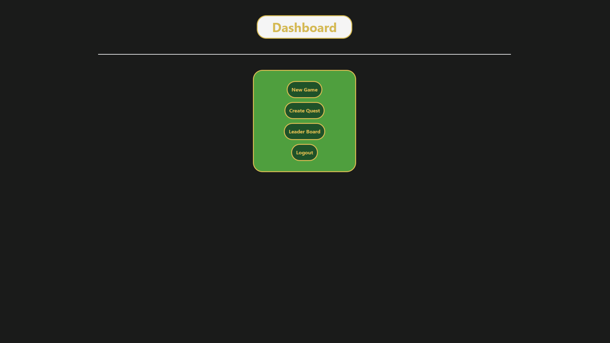

##### New game allows users to select a category from the database to play through
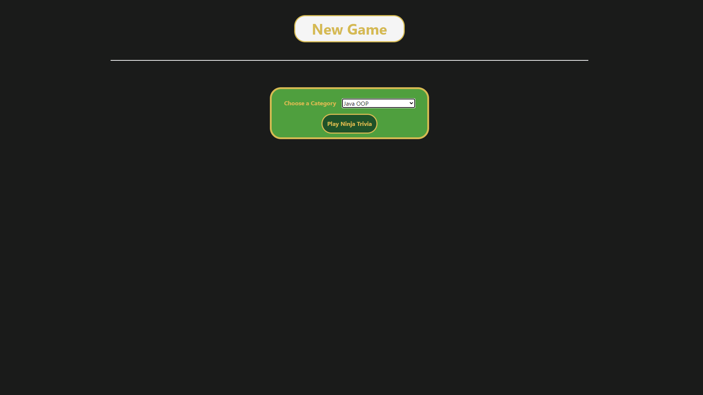

##### The user will answer a series of questions randomly selected from the category
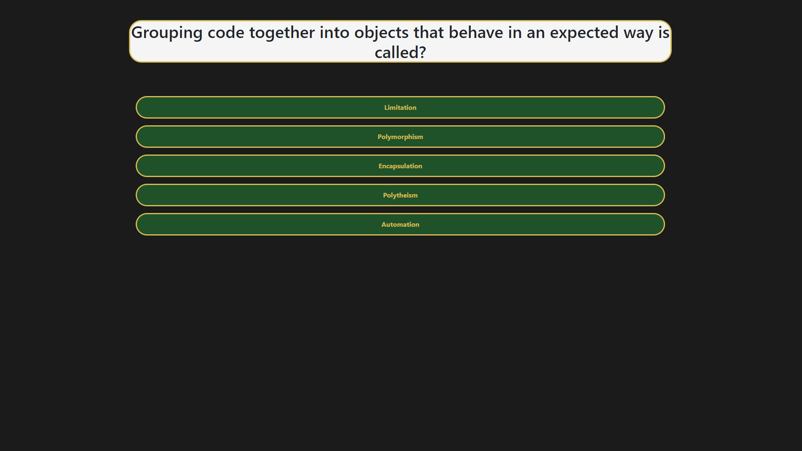

##### If the user answers the question correctly they get 500points
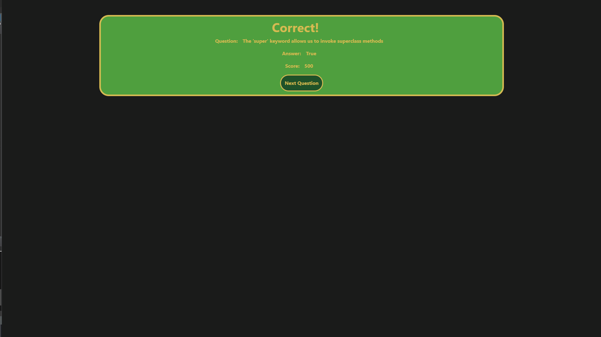

##### If the user answers the question incorrectly they recieve 0 points but are shown the correct answer
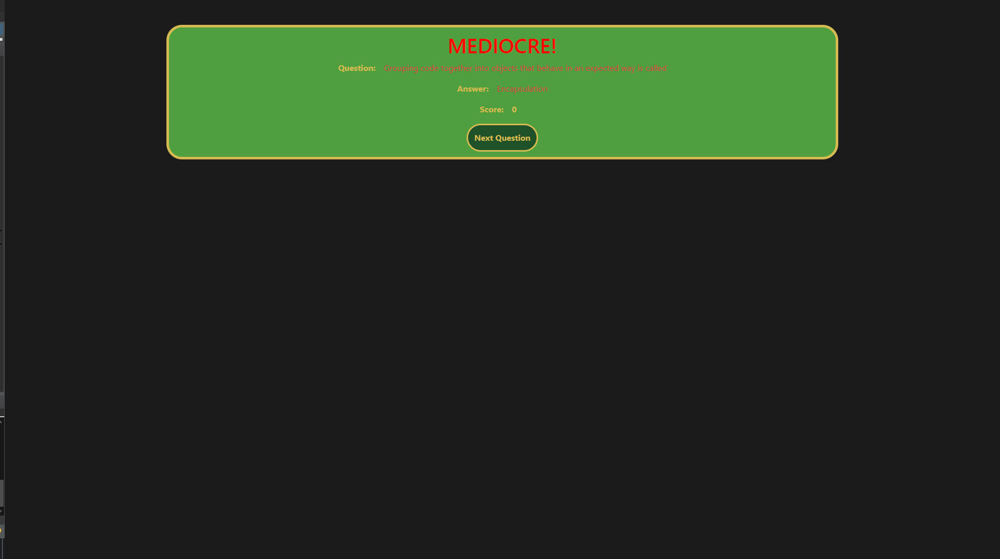

##### At the end of the game the user sees how they compare to other users who have played that category
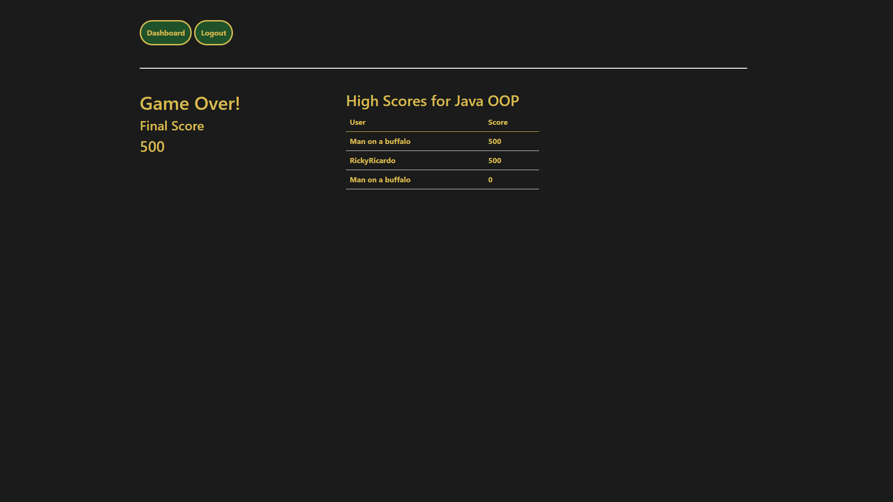

##### Highscore shows the user the scores and users who played each category.
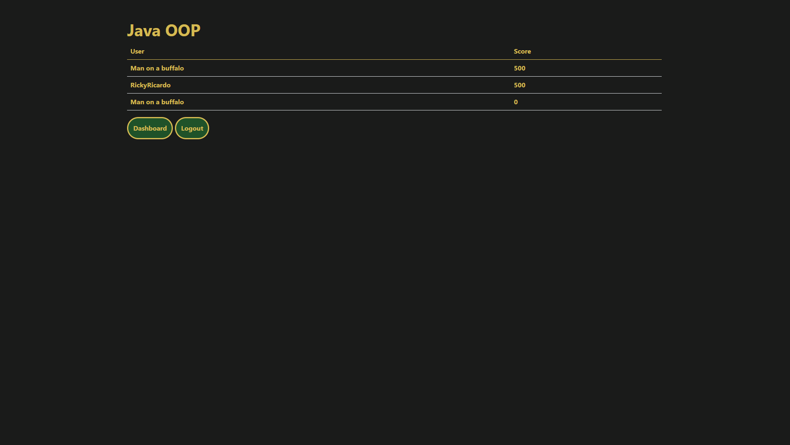

##### Create game allows users to create a trivia category, questions for the category and possible answers for the question. One of the possible answers must match the answer input for the created question
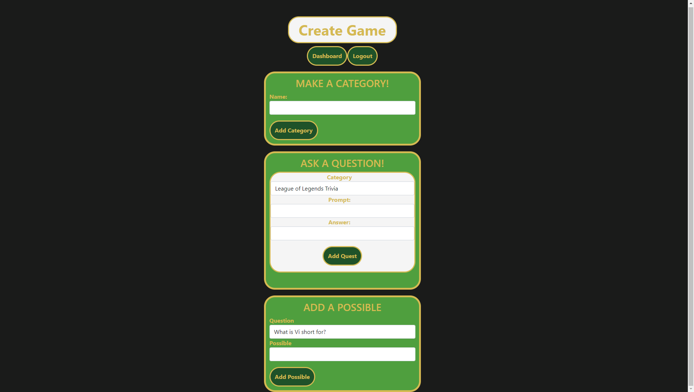
